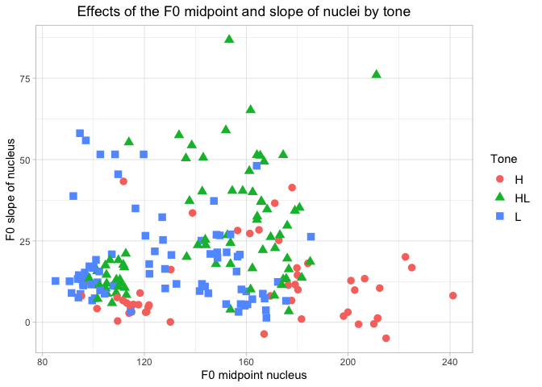

-   Some basic data visualizations in R studio This data is from my
    linguistic field work \*

-   loading data frame

<!-- -->

    dat <- read.csv("subsetdataLexMidpointF0.csv", sep = ",")

Q plot
======

-   Load the package for plots

<!-- -->

    library(ggplot2)

-   This quick plot shows the fundamental frequency of measured in the
    midpoint (y-axis) and onset of the vowel (x-axis) of six speakers.

<!-- -->

    qplot(vowelOnsetF0, midpointF0, data = dat, color = Speaker)

ggplot with some more specifications
====================================

-   Black and white with 'shape' to distinguish the levels

<!-- -->

    ggplot() + geom_point(data = dat, aes(x = vowelOnsetF0, y = midpointF0, shape = Speaker)) +
      ggtitle("Midpoint of fundamental frequency")

      theme(plot.title = element_text(hjust = 0.5))

    ## List of 1
    ##  $ plot.title:List of 11
    ##   ..$ family       : NULL
    ##   ..$ face         : NULL
    ##   ..$ colour       : NULL
    ##   ..$ size         : NULL
    ##   ..$ hjust        : num 0.5
    ##   ..$ vjust        : NULL
    ##   ..$ angle        : NULL
    ##   ..$ lineheight   : NULL
    ##   ..$ margin       : NULL
    ##   ..$ debug        : NULL
    ##   ..$ inherit.blank: logi FALSE
    ##   ..- attr(*, "class")= chr [1:2] "element_text" "element"
    ##  - attr(*, "class")= chr [1:2] "theme" "gg"
    ##  - attr(*, "complete")= logi FALSE
    ##  - attr(*, "validate")= logi TRUE

    ggplot() + geom_point(data = dat, aes(x=midpointF0, y=SlopeF0, shape=Tone, color=Tone), size = 3) +
      ggtitle("Effects of the F0 midpoint and slope of nuclei by tone")  +
      theme_light() +theme(legend.text=element_text(size=rel(1))) +
      theme(plot.title = element_text(hjust = 0.4)) + ylab("F0 slope of nucleus") + xlab("F0 midpoint nucleus") 

